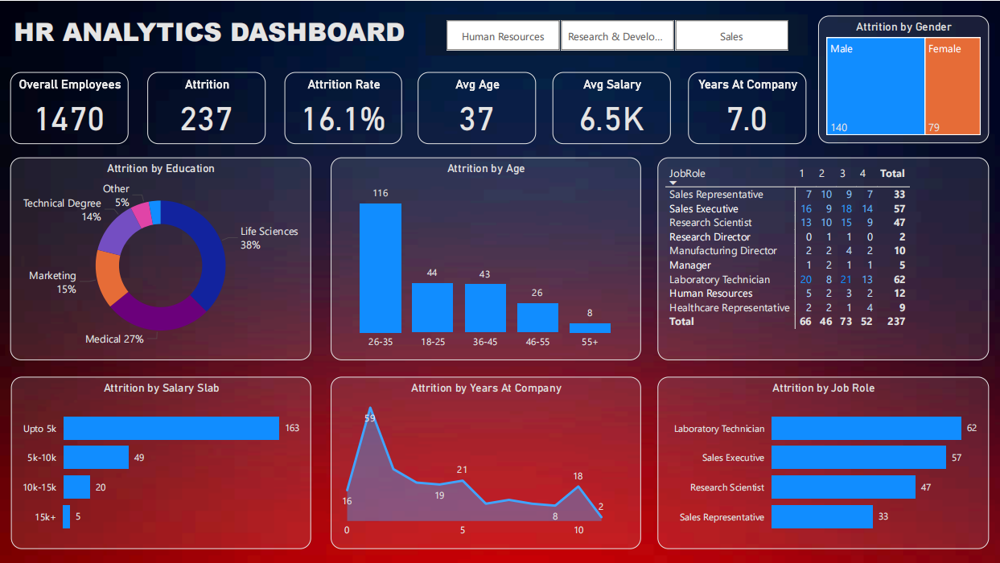

# 💼 HR Analytics Dashboard (Power BI)

## 📌 Objective

Help an organization to improve employee performance and increase employee retention (reduce attrition) by creating an **HR Analytics Dashboard**.

---

## 📂 Dataset

The dataset includes employee details such as:

- Age
- Gender
- Education Background
- Job Role
- Salary Slab
- Years at Company
- Attrition Status

> 📊 Note: This is a fictional dataset used for analytical purposes.

---

## 🛠️ Steps Followed

1. **Data Collection** – Imported dataset into Power BI.
2. **Data Cleaning** – Removed duplicates, handled nulls, ensured consistency.
3. **Data Modeling** – Created relationships between tables, normalized data.
4. **DAX Calculations** – Built measures for attrition rate, average salary, age, etc.
5. **Visualization** – Designed an interactive dashboard using filters and slicers.

---

## 📈 Key Insights

- **Attrition Rate**: 16.1% out of 1470 employees
- **Most affected age group**: 26-35 years
- **Education background with high attrition**: Life Sciences
- **Roles with highest attrition**:
  - Laboratory Technician (62)
  - Sales Executive (57)
  - Research Scientist (47)
- **Most attrition observed in**:
  - Employees with salary **under 5K**
- **Average Age**: 37
- **Average Salary**: 6.5K
- **Average Years at Company**: 7

---

## ✅ Action Items

- Focus retention efforts on employees aged 26–35.
- Reassess workload and satisfaction for high-attrition roles.
- Improve pay structure for employees earning below 5K.
- Enhance employee engagement and career development programs.

---

## 📚 Project Learnings

- Identified key factors to reduce attrition.
- Improved hiring and onboarding processes.
- Enhanced overall employee experience.
- Increased workforce productivity.
- Built employee trust through data-driven decisions.

---

## 📸 Dashboard Preview

---

## 🚀 Tools Used

- Power BI
- DAX (Data Analysis Expressions)
- Excel
- GitHub

